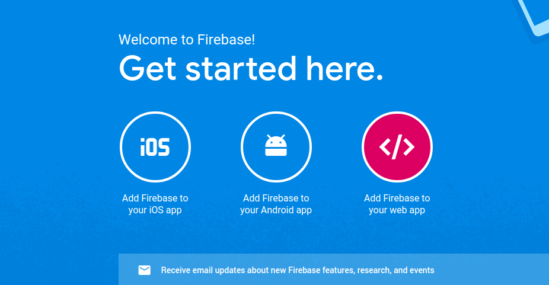
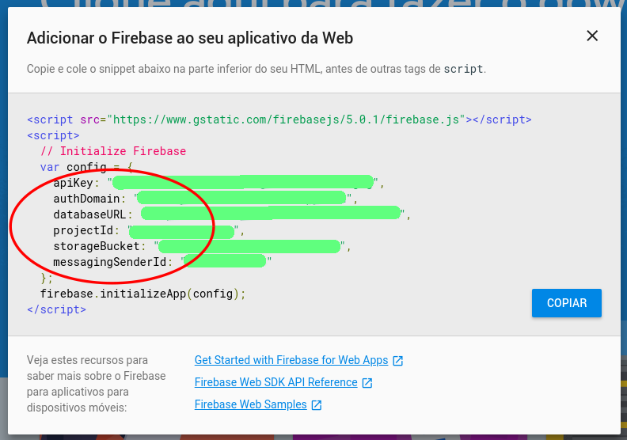

# vue-crud
Simple VueJS CRUD using Firebas Firestore.

Front-end framework used: Vuetify https://vuetifyjs.com/en/

## Cloning the respository

First of all, you need clone this repository, atfer do this enter in the folder with:

` cd vue-crud `

so, run the comand bellow to install all dependences of the project :

` npm install `

## Setup Firebase

Now you need to create a Firebase account, do this in https://firebase.google.com , you can use your regular Google account .

Now, create a project, go to Project Overview and click in `"Add Firebase to your web app"`, as bellow



Copy the setting as bellow:



Now in the vue-crud , create a folder named `firebase` and into this folder, an archive named `index.js` ->  `firebase/index.js`

Into the `index.js` file, paste the code below:

```
import firebase from 'firebase'
import 'firebase/firestore'

const config = {
  apiKey: 'PasteYourApiKey',
  authDomain: 'PasteYourAuthDomainHere',
  databaseURL: 'PasteYourDatabaseURLHere',
  projectId: 'PasteYouProjectIdHere',
  storageBucket: 'PasteYourStorageBucketHere',
  messagingSenderId: 'PasteYourMessagingSenderIdHere',
  timestampsInSnapshots: true
}

const firebaseapp = firebase.initializeApp(config)

export default firebaseapp.firestore()
```
Now, open the vue-crud folder in terminal and paste the command bellow to install the Firenase dependence:

`npm install firebase --save`

Well, now you just have to use it in your project.

A live demo cant be found in 

https://nuxtcrud.firebaseapp.com
